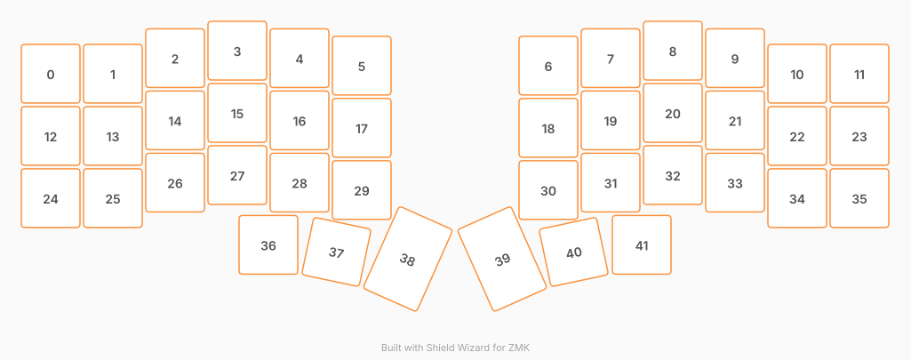

# ZMK Configuration for PocketBoard

*Generated by Shield Wizard for ZMK*



Download compiled firmware from the Actions tab. <https://zmk.dev/docs/user-setup#installing-the-firmware>

Edit your keymap <https://zmk.dev/docs/keymaps>.
User keymap is located at [`config/pocketboard.keymap`](config/pocketboard.keymap).

-----

<details>
<summary>
Shield Wizard Debug Information
</summary>

In case of broken configuration, here is the Shield Wizard internal data used to generate this configuration:

Commit: 84a348b08cf4fec4a5441a46147e9a345b10ffab

```json
{"name":"PocketBoard","shield":"pocketboard","dongle":false,"modules":[],"layout":[{"id":"01M26M1PEF6RZ94ZMMKCZBW73R","part":0,"row":0,"col":0,"w":1,"h":1,"x":0,"y":0.37,"r":0,"rx":0,"ry":0},{"id":"01M26M1PEF3BKSCHEZ6BZZ6F0Y","part":0,"row":0,"col":1,"w":1,"h":1,"x":1,"y":0.37,"r":0,"rx":0,"ry":0},{"id":"01M26M1PEFGREX6DCDYVDM3NGV","part":0,"row":0,"col":2,"w":1,"h":1,"x":2,"y":0.12,"r":0,"rx":0,"ry":0},{"id":"01M26M1PEF9PNMQ6GAFK8PTAS1","part":0,"row":0,"col":3,"w":1,"h":1,"x":3,"y":0,"r":0,"rx":0,"ry":0},{"id":"01M26M1PEF8JH4ZDAC14K6KQ8J","part":0,"row":0,"col":4,"w":1,"h":1,"x":4,"y":0.12,"r":0,"rx":0,"ry":0},{"id":"01M26M1PEF1GW58WFAJA4ND96G","part":0,"row":0,"col":5,"w":1,"h":1,"x":5,"y":0.24,"r":0,"rx":0,"ry":0},{"id":"01M26M1PEFYE3A19CPNDRQWS0Z","part":0,"row":0,"col":6,"w":1,"h":1,"x":8,"y":0.24,"r":0,"rx":0,"ry":0},{"id":"01M26M1PEFWHVX0AR3QE29YJ83","part":0,"row":0,"col":7,"w":1,"h":1,"x":9,"y":0.12,"r":0,"rx":0,"ry":0},{"id":"01M26M1PEF09Z39RWFVSB83E7Q","part":0,"row":0,"col":8,"w":1,"h":1,"x":10,"y":0,"r":0,"rx":0,"ry":0},{"id":"01M26M1PEFVA4XRQ5FG0KRMCMB","part":0,"row":0,"col":9,"w":1,"h":1,"x":11,"y":0.12,"r":0,"rx":0,"ry":0},{"id":"01M26M1PEFX81REZNTZEHZN8EC","part":0,"row":0,"col":10,"w":1,"h":1,"x":12,"y":0.37,"r":0,"rx":0,"ry":0},{"id":"01M26M1PEFEKGMRFFAB4Z37Q9E","part":0,"row":0,"col":11,"w":1,"h":1,"x":13,"y":0.37,"r":0,"rx":0,"ry":0},{"id":"01M26M1PEFPN26MTT2ZPNKWFJ2","part":0,"row":1,"col":0,"w":1,"h":1,"x":0,"y":1.37,"r":0,"rx":0,"ry":0},{"id":"01M26M1PEF8QSHGYJFKXH1ACMB","part":0,"row":1,"col":1,"w":1,"h":1,"x":1,"y":1.37,"r":0,"rx":0,"ry":0},{"id":"01M26M1PEF092RC0QBA75912YD","part":0,"row":1,"col":2,"w":1,"h":1,"x":2,"y":1.12,"r":0,"rx":0,"ry":0},{"id":"01M26M1PEFFASCPJGP2FD83HQ3","part":0,"row":1,"col":3,"w":1,"h":1,"x":3,"y":1,"r":0,"rx":0,"ry":0},{"id":"01M26M1PEFQMN82YEYHHFF3WZK","part":0,"row":1,"col":4,"w":1,"h":1,"x":4,"y":1.12,"r":0,"rx":0,"ry":0},{"id":"01M26M1PEF8HA3CCSGTXRXYVGD","part":0,"row":1,"col":5,"w":1,"h":1,"x":5,"y":1.24,"r":0,"rx":0,"ry":0},{"id":"01M26M1PEF34M5Y7XWYSSY5J0H","part":0,"row":1,"col":6,"w":1,"h":1,"x":8,"y":1.24,"r":0,"rx":0,"ry":0},{"id":"01M26M1PEFEDVEJPYYD50QGGEM","part":0,"row":1,"col":7,"w":1,"h":1,"x":9,"y":1.12,"r":0,"rx":0,"ry":0},{"id":"01M26M1PEFJ3DGB4THAG5S897Y","part":0,"row":1,"col":8,"w":1,"h":1,"x":10,"y":1,"r":0,"rx":0,"ry":0},{"id":"01M26M1PEFZMYQW363NG2ZJFJX","part":0,"row":1,"col":9,"w":1,"h":1,"x":11,"y":1.12,"r":0,"rx":0,"ry":0},{"id":"01M26M1PEFDM1SN2BQ0VVQ9YVN","part":0,"row":1,"col":10,"w":1,"h":1,"x":12,"y":1.37,"r":0,"rx":0,"ry":0},{"id":"01M26M1PEFYX2AYB2ZB85YV8G6","part":0,"row":1,"col":11,"w":1,"h":1,"x":13,"y":1.37,"r":0,"rx":0,"ry":0},{"id":"01M26M1PEGMBV057MZPZHXHVBZ","part":0,"row":2,"col":0,"w":1,"h":1,"x":0,"y":2.37,"r":0,"rx":0,"ry":0},{"id":"01M26M1PEG5E4D0G4RMFJR5VTA","part":0,"row":2,"col":1,"w":1,"h":1,"x":1,"y":2.37,"r":0,"rx":0,"ry":0},{"id":"01M26M1PEGTG3CXS5X3PW9Q6H4","part":0,"row":2,"col":2,"w":1,"h":1,"x":2,"y":2.12,"r":0,"rx":0,"ry":0},{"id":"01M26M1PEG5GYD40JD36M66QCT","part":0,"row":2,"col":3,"w":1,"h":1,"x":3,"y":2,"r":0,"rx":0,"ry":0},{"id":"01M26M1PEGYBEGR0R5KB1GNKMV","part":0,"row":2,"col":4,"w":1,"h":1,"x":4,"y":2.12,"r":0,"rx":0,"ry":0},{"id":"01M26M1PEGRJM6DY1E7CNEJB24","part":0,"row":2,"col":5,"w":1,"h":1,"x":5,"y":2.24,"r":0,"rx":0,"ry":0},{"id":"01M26M1PEGWX3ZXB37R4VV2EZ7","part":0,"row":2,"col":6,"w":1,"h":1,"x":8,"y":2.24,"r":0,"rx":0,"ry":0},{"id":"01M26M1PEGSAMZ21PTH3ZJ180J","part":0,"row":2,"col":7,"w":1,"h":1,"x":9,"y":2.12,"r":0,"rx":0,"ry":0},{"id":"01M26M1PEGBN2CSGH6TC06GGQD","part":0,"row":2,"col":8,"w":1,"h":1,"x":10,"y":2,"r":0,"rx":0,"ry":0},{"id":"01M26M1PEGY2RMPQTGJAEWJ1GR","part":0,"row":2,"col":9,"w":1,"h":1,"x":11,"y":2.12,"r":0,"rx":0,"ry":0},{"id":"01M26M1PEGX92RT7EF18CFNF5F","part":0,"row":2,"col":10,"w":1,"h":1,"x":12,"y":2.37,"r":0,"rx":0,"ry":0},{"id":"01M26M1PEGN67AS24SVHT5TP27","part":0,"row":2,"col":11,"w":1,"h":1,"x":13,"y":2.37,"r":0,"rx":0,"ry":0},{"id":"01M26M1PEGN1E3W02NN09VT8ST","part":0,"row":3,"col":3,"w":1,"h":1,"x":3.5,"y":3.12,"r":0,"rx":0,"ry":0},{"id":"01M26M1PEGG4EQFR4BKBWJJ89K","part":0,"row":3,"col":4,"w":1,"h":1,"x":4.5,"y":3.12,"r":12,"rx":4.5,"ry":4.12},{"id":"01M26M1PEG8QE2DSSKSBDF8CW1","part":0,"row":3,"col":5,"w":1,"h":1.5,"x":5.48,"y":2.83,"r":24,"rx":5.48,"ry":4.33},{"id":"01M26M1PEGJ0PY10P97RG87JT7","part":0,"row":3,"col":6,"w":1,"h":1.5,"x":7.52,"y":2.83,"r":-24,"rx":8.52,"ry":4.33},{"id":"01M26M1PEGJQ04HAJ4MTH8ZNP0","part":0,"row":3,"col":7,"w":1,"h":1,"x":8.5,"y":3.12,"r":-12,"rx":9.5,"ry":4.12},{"id":"01M26M1PEGC2TFWRMR0CF1YF8B","part":0,"row":3,"col":8,"w":1,"h":1,"x":9.5,"y":3.12,"r":0,"rx":0,"ry":0}],"parts":[{"name":"unibody","controller":"nice_nano_v2","pins":{"d10":{"usage":"kscan","kscan":"01M26MMSTCYMMV9DS85V92T42D","role":"output"},"d8":{"usage":"kscan","kscan":"01M26MMSTCYMMV9DS85V92T42D","role":"output"},"d9":{"usage":"kscan","kscan":"01M26MMSTCYMMV9DS85V92T42D","role":"output"},"d4":{"usage":"kscan","kscan":"01M26MMSTCYMMV9DS85V92T42D","role":"output"},"d5":{"usage":"kscan","kscan":"01M26MMSTCYMMV9DS85V92T42D","role":"output"},"d6":{"usage":"kscan","kscan":"01M26MMSTCYMMV9DS85V92T42D","role":"output"},"d14":{"usage":"kscan","kscan":"01M26MMSTCYMMV9DS85V92T42D","role":"input"},"d15":{"usage":"kscan","kscan":"01M26MMSTCYMMV9DS85V92T42D","role":"input"},"d16":{"usage":"kscan","kscan":"01M26MMSTCYMMV9DS85V92T42D","role":"input"},"d18":{"usage":"kscan","kscan":"01M26MMSTCYMMV9DS85V92T42D","role":"input"},"d19":{"usage":"kscan","kscan":"01M26MMSTCYMMV9DS85V92T42D","role":"output"},"d20":{"usage":"kscan","kscan":"01M26MMSTCYMMV9DS85V92T42D","role":"output"},"d21":{"usage":"kscan","kscan":"01M26MMSTCYMMV9DS85V92T42D","role":"output"},"d2":{"usage":"kscan","kscan":"01M26MMSTCYMMV9DS85V92T42D","role":"output"},"d3":{"usage":"kscan","kscan":"01M26MMSTCYMMV9DS85V92T42D","role":"output"},"d7":{"usage":"kscan","kscan":"01M26MMSTCYMMV9DS85V92T42D","role":"output"},"d0":{"usage":"kscan","kscan":"01M26MMSTCYMMV9DS85V92T42D","role":"input"},"d1":{"usage":"kscan","kscan":"01M26MMSTCYMMV9DS85V92T42D","role":"input"},"p101":{"usage":"kscan","kscan":"01M26MMSTCYMMV9DS85V92T42D","role":"input"},"p102":{"usage":"kscan","kscan":"01M26MMSTCYMMV9DS85V92T42D","role":"input"}},"kscans":[{"kind":"matrix","id":"01M26MMSTCYMMV9DS85V92T42D","diodes":true}],"keys":{"01M26M1PEF9PNMQ6GAFK8PTAS1":{"input":"d14","output":"d10"},"01M26M1PEFFASCPJGP2FD83HQ3":{"input":"d15","output":"d10"},"01M26M1PEG5GYD40JD36M66QCT":{"input":"d16","output":"d10"},"01M26M1PEGN1E3W02NN09VT8ST":{"input":"d18","output":"d10"},"01M26M1PEF8JH4ZDAC14K6KQ8J":{"input":"d14","output":"d8"},"01M26M1PEFQMN82YEYHHFF3WZK":{"input":"d15","output":"d8"},"01M26M1PEGYBEGR0R5KB1GNKMV":{"input":"d16","output":"d8"},"01M26M1PEGG4EQFR4BKBWJJ89K":{"input":"d18","output":"d8"},"01M26M1PEF1GW58WFAJA4ND96G":{"input":"d14","output":"d9"},"01M26M1PEF8HA3CCSGTXRXYVGD":{"input":"d15","output":"d9"},"01M26M1PEGRJM6DY1E7CNEJB24":{"input":"d16","output":"d9"},"01M26M1PEG8QE2DSSKSBDF8CW1":{"input":"d18","output":"d9"},"01M26M1PEF6RZ94ZMMKCZBW73R":{"input":"d14","output":"d4"},"01M26M1PEFPN26MTT2ZPNKWFJ2":{"input":"d15","output":"d4"},"01M26M1PEGMBV057MZPZHXHVBZ":{"input":"d16","output":"d4"},"01M26M1PEF3BKSCHEZ6BZZ6F0Y":{"input":"d14","output":"d5"},"01M26M1PEF8QSHGYJFKXH1ACMB":{"input":"d15","output":"d5"},"01M26M1PEG5E4D0G4RMFJR5VTA":{"input":"d16","output":"d5"},"01M26M1PEFGREX6DCDYVDM3NGV":{"input":"d14","output":"d6"},"01M26M1PEF092RC0QBA75912YD":{"input":"d15","output":"d6"},"01M26M1PEGTG3CXS5X3PW9Q6H4":{"input":"d16","output":"d6"},"01M26M1PEFYE3A19CPNDRQWS0Z":{"input":"d0","output":"d19"},"01M26M1PEF34M5Y7XWYSSY5J0H":{"input":"d1","output":"d19"},"01M26M1PEGWX3ZXB37R4VV2EZ7":{"input":"p101","output":"d19"},"01M26M1PEFWHVX0AR3QE29YJ83":{"input":"d0","output":"d20"},"01M26M1PEFEDVEJPYYD50QGGEM":{"input":"d1","output":"d20"},"01M26M1PEGSAMZ21PTH3ZJ180J":{"input":"p101","output":"d20"},"01M26M1PEF09Z39RWFVSB83E7Q":{"input":"d0","output":"d21"},"01M26M1PEFJ3DGB4THAG5S897Y":{"input":"d1","output":"d21"},"01M26M1PEGBN2CSGH6TC06GGQD":{"input":"p101","output":"d21"},"01M26M1PEFVA4XRQ5FG0KRMCMB":{"input":"d0","output":"d2"},"01M26M1PEFZMYQW363NG2ZJFJX":{"input":"d1","output":"d2"},"01M26M1PEGY2RMPQTGJAEWJ1GR":{"input":"p101","output":"d2"},"01M26M1PEFX81REZNTZEHZN8EC":{"input":"d0","output":"d3"},"01M26M1PEFDM1SN2BQ0VVQ9YVN":{"input":"d1","output":"d3"},"01M26M1PEGX92RT7EF18CFNF5F":{"input":"p101","output":"d3"},"01M26M1PEFEKGMRFFAB4Z37Q9E":{"input":"d0","output":"d7"},"01M26M1PEFYX2AYB2ZB85YV8G6":{"input":"d1","output":"d7"},"01M26M1PEGN67AS24SVHT5TP27":{"input":"p101","output":"d7"},"01M26M1PEGJ0PY10P97RG87JT7":{"input":"p102","output":"d19"},"01M26M1PEGJQ04HAJ4MTH8ZNP0":{"input":"p102","output":"d20"},"01M26M1PEGC2TFWRMR0CF1YF8B":{"input":"p102","output":"d21"}},"encoders":[],"buses":{}}]}
```

</details>
